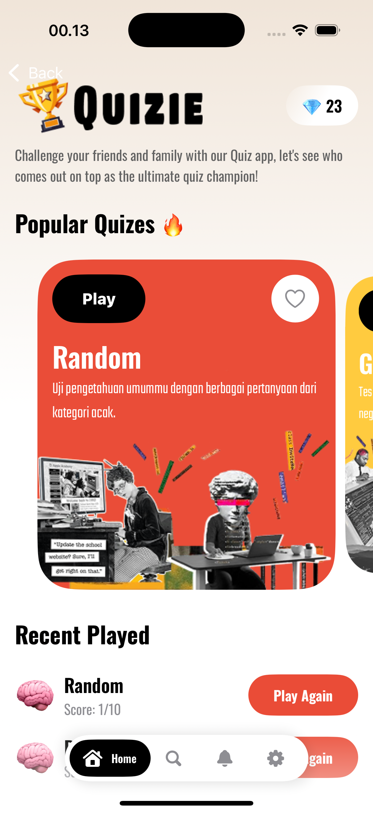
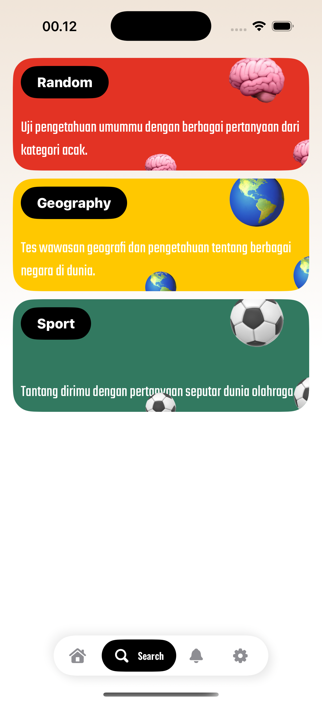
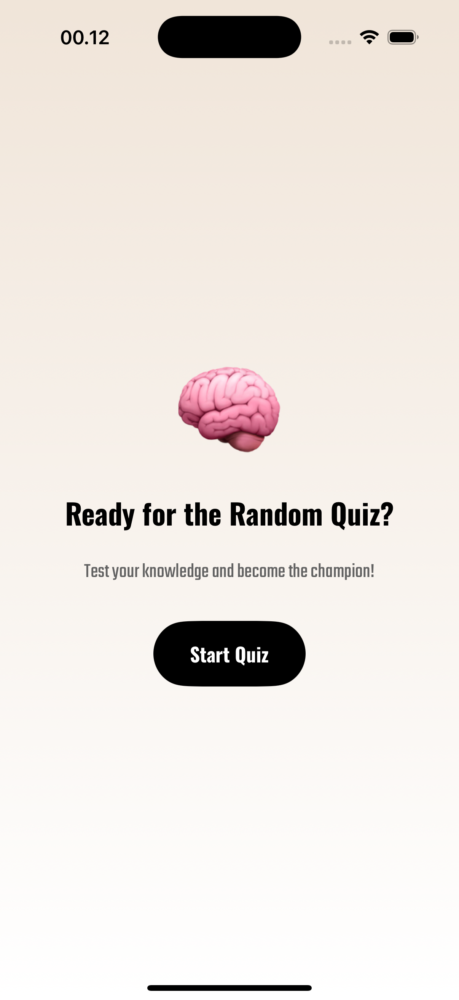
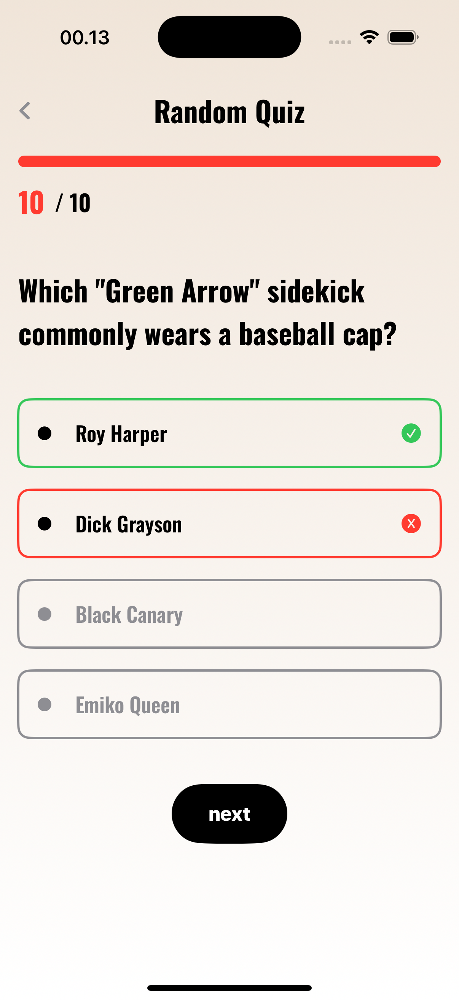
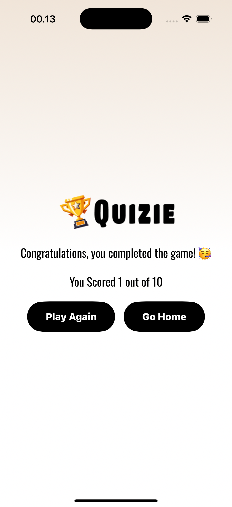

# Quizie

Quizie is an interactive quiz application built with Swift and SwiftUI. It allows users to answer quiz questions with an engaging and responsive interface.

⚠️ **Status:** The application is still in development (**Still in Progress**) and may contain many bugs.

## 📌 Features

- Quiz questions from various categories
- Interactive answer selection
- Final score display after completing the quiz
- Simple and attractive UI

## 🚀 Technologies Used

- Swift
- SwiftUI
- MVVM Architecture

## 🖼️ Screenshot

<table width="100%">
<tr>
<td><h3 align="center">Home Screen</h3></td>
<td><h3 align="center">Category Screen</h3></td>
</tr>
<tr>
<td><h3 align="center">Confirmation Screen</h3></td>
<td><h3 align="center">Question Screen</h3></td>
</tr>
<tr>
<td><h3 align="center">Score Screen</h3></td>
</tr>
